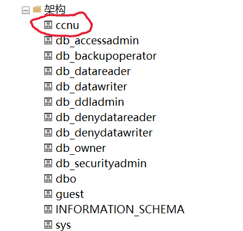

# 列表测试

## 无序列表
*   项目 A
*   项目 B
    *   嵌套项目 B1
    *   嵌套项目 B2
*   项目 C

## 有序列表
1.  第一个项目
2.  第二个项目
    1.  嵌套有序项目 2.1
    2.  嵌套有序项目 2.2
3.  第三个项目

## 混合嵌套列表
*   外层无序 1
    1.  内层有序 1.1
    2.  内层有序 1.2
        *   最内层无序 1.2.1
*   外层无序 2

## 包含多段落的列表项
*   这是一个列表项。
    这是列表项的第二段。
    
    ```python
    def hello_world():
        print("Hello, world!")
    ```
    
    这是列表项的第三段。

*   另一个列表项，包含图片。
    
    
    
    图片后的文字。

## 包含内联代码的列表项
*   项目 A 包含 `inline code`。
*   项目 B 包含 **粗体** 和 *斜体*。 