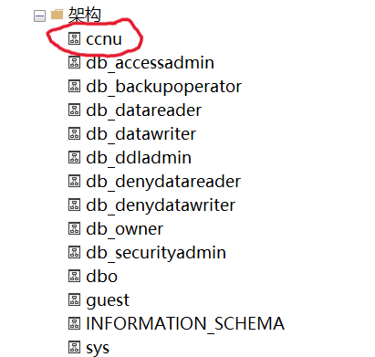

# 一级标题示例

这是一个普通段落，包含一些 **粗体文本** 和 *斜体文本*。
还包含一个 `行内代码` 示例。

## 二级标题示例

下面是一个图片：


下面是一个代码块：
```python
def hello_world():
    print("Hello, Word from Markdown!")

class MyClass:
    pass
```

### 三级标题：列表

无序列表:
*   列表项1
*   列表项2，包含 **粗体**
    *   嵌套列表项 2.1
*   列表项3

有序列表:
1.  第一项
2.  第二项 `code`
3.  第三项 *italic*

---

### 四级标题：表格

| 表头1 | 表头2 | 表头3 |
|-------|-------|-------|
| 内容1 | 内容2 | 内容3 |
| A     | B     | C     |

这是另一个段落。
